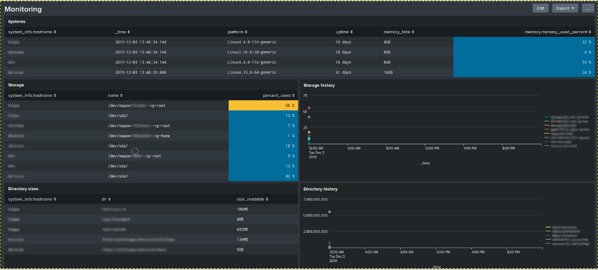

# simple_monitoring

Simple Script to monitor Linux servers

## Installation
This script requires psutils:

    sudo pip3 install psutils

Download the last version of the script in the server

    wget "https://raw.githubusercontent.com/xaled/simple_monitoring/monitor.py"
    chmod +x monitor.py
    
## Usage
To run the script in the monitored server:

    ./monitor.py config.json

This command generate two files: `monitor.log` and `monitor.out`. `monitor.log` contains script execution logs, 
and `monitor.out` contains the result of the script.

**Example for script result (indented)**:

~~~json
{
   "timestamp":1575363539.052425,
   "system_info":{
      "hostname":"Ubuntu",
      "platform_name":"Linux",
      "platform_version":"4.15.0-70-generic",
      "uuid":119071799081202,
      "uptime":74383,
      "cpu_count":8,
      "cpu_usage":8.4
   },
   "drives":[
      {
         "name":"/dev/sda1",
         "mount_point":"/",
         "type":"ext4",
         "total_size":418223087616,
         "used_size":315986825216,
         "percent_used":79.6
      }
   ],
   "memory":{
      "memory_total":33613602816,
      "memory_used":6718783488,
      "memory_used_percent":24.6
   },
   "network":{
      "network_up":132,
      "network_down":118,
      "network_cards":[
         {
            "interface":"lo",
            "snics":[
               {
                  "family":"AddressFamily.AF_INET",
                  "address":"127.0.0.1",
                  "netmask":"255.0.0.0"
               },
               {
                  "family":"AddressFamily.AF_INET6",
                  "address":"::1",
                  "netmask":"ffff:ffff:ffff:ffff:ffff:ffff:ffff:ffff"
               },
               {
                  "family":"AddressFamily.AF_PACKET",
                  "address":"00:00:00:00:00:00",
                  "netmask":null
               }
            ]
         },
         {
            "interface":"eth0",
            "snics":[
               {
                  "family":"AddressFamily.AF_INET",
                  "address":"192.168.0.2",
                  "netmask":"255.255.255.0"
               },
               {
                  "family":"AddressFamily.AF_PACKET",
                  "address":"00:00:00:00:00:00",
                  "netmask":null
               }
            ]
         }
      ]
   }
}
~~~
    
I've included a sample cron script `cron.sample.sh` to run the script with the cron service,
from an another host via SSH. 
Note: [you will have to create an SSH key and authorize it in the monitored server.](https://www.digitalocean.com/community/tutorials/how-to-set-up-ssh-keys--2). 

## Dashboard example for Splunk

You can find the code for this dashboard in `splunk_dashboard.xml`.

## Configuration examples
### Check if a service is running
todo
### Check the size of a directory
todo
###